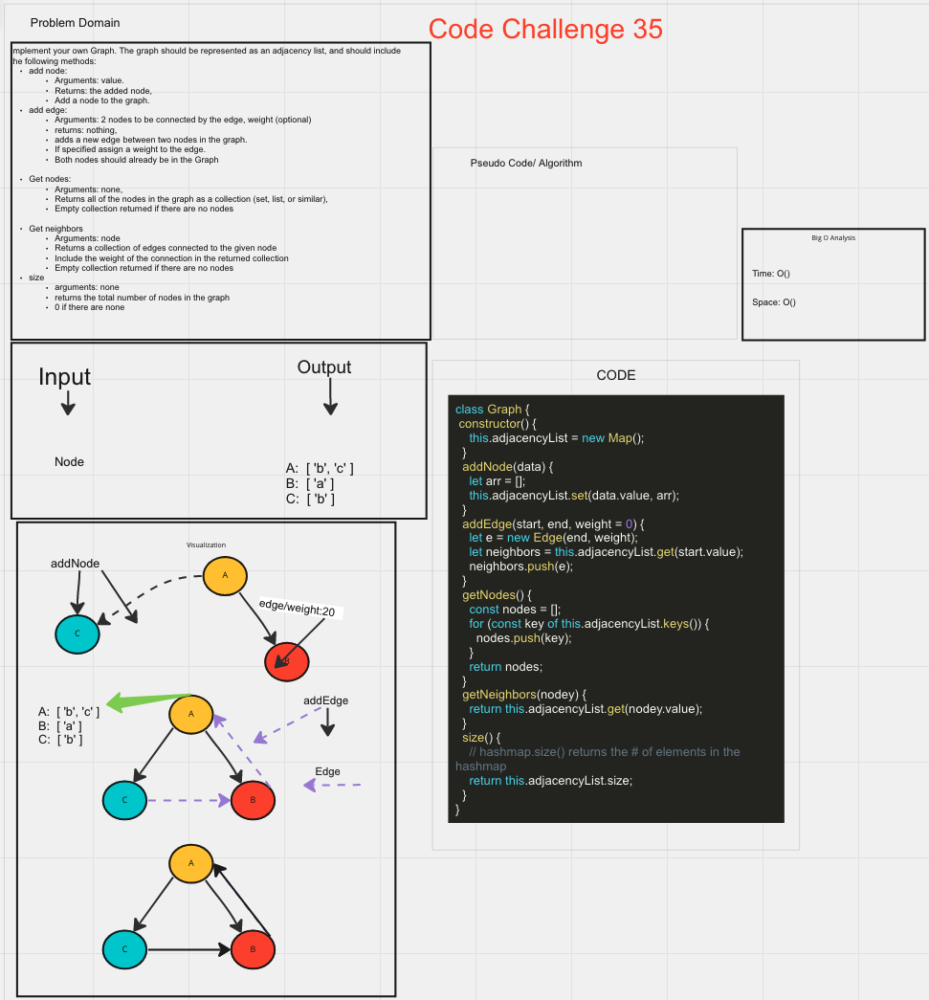

# Code Challenge 35

# Challenge/Features

Implement your own Graph. The graph should be represented as an adjacency list, and should include the following methods:

- add node

  - Arguments: value
  - Returns: The added node
  - Add a node to the graph

- add edge

  - Arguments: 2 nodes to be connected by the edge, weight (optional)
  - Returns: nothing
  - Adds a new edge between two nodes in the graph
  - If specified, assign a weight to the edge
  - Both nodes should already be in the Graph

- get nodes

  - Arguments: none
  - Returns all of the nodes in the graph as a collection (set, list, or similar)
  - Empty collection returned if there are no nodes

- get neighbors

  - Arguments: node
  - Returns a collection of edges connected to the given node
    - Include the weight of the connection in the returned collection
  - Empty collection returned if there are no nodes

- size
  - Arguments: none
  - Returns the total number of nodes in the graph
  - 0 if there are none

## Approach & Efficiency

worked with Tony in a replit to break down every step of the problem.

## Whiteboard

### Collaborators

- Tony R.
