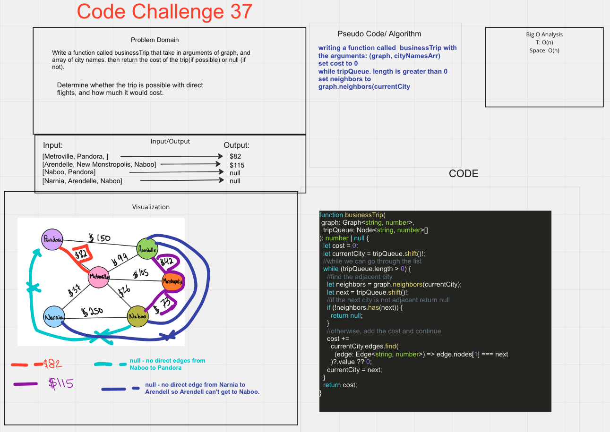

# Code Challenge 37

# Challenge/Feature Tasks

1. Write a function called business trip
2. Arguments: graph, array of city names
3. Return: the cost of the trip (if it’s possible) or null (if not)

## Approach & Efficiency

- worked through code challenge with class during lecture. Followed along with David.
  getting errors frok the test.ts

## Whiteboard

## PR

- <https://github.com/Marthaquinram/data-structure-algorithms-401/pull/9>

## Runing Test

- To run the test, do npm test costbiz.test.ts

## Collaborators

- Entire Class
