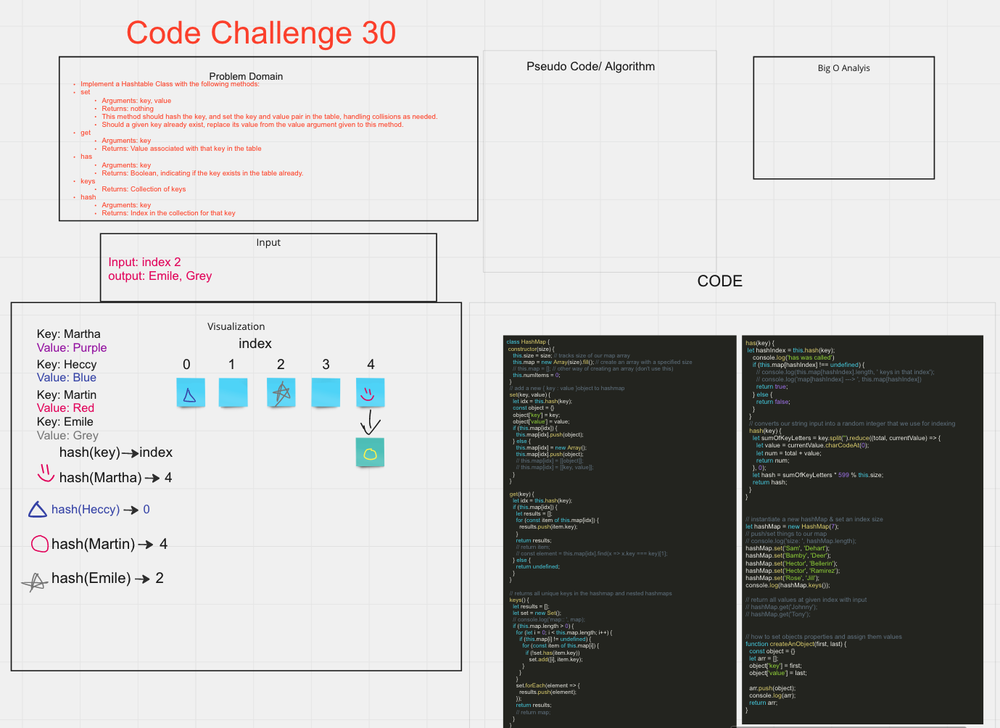

# Challenge 30

## Hash Table-

Implement a Hashtable Class with the following methods:

- set
  - Arguments: key, value
  - Returns: nothing
    This method should hash the key, and set the key and value pair in the table, handling collisions as needed.
  - Should a given key already exist, replace its value from the value argument given to this method.
- get
  - Arguments: key
  - Returns: Value associated with that key in the table
- has
  - Arguments: key
  - Returns: Boolean, indicating if the key exists in the table already.
- keys
  - Returns: Collection of keys
- hash
  - Arguments: key
  - Returns: Index in the collection for that key

## Whiteboard

- CC30
  

## PR

- <https://github.com/Marthaquinram/data-structure-algorithms-401/pull/10>

## Starting up

- To run the test, do npm test

## Collaborators

- Tony R.
