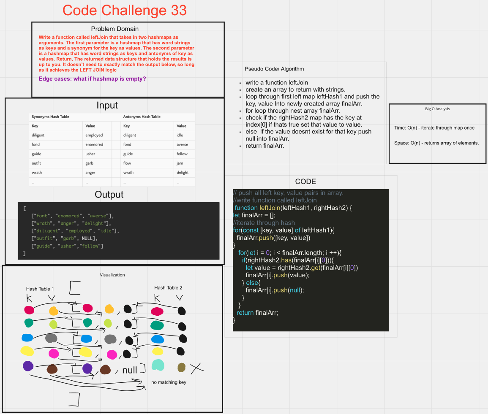

# Code Challenge

## hashmap-left-join

## Challenge/Feature Tasks

- Write a function called left join
- Arguments: two hash maps
  - The first parameter is a hashmap that has word strings as keys, and a synonym of the key as values.
  - The second parameter is a hashmap that has word strings as keys, and antonyms of the key as values.

## PR

- PR
  - <https://github.com/Marthaquinram/data-structure-algorithms-401/pull/13>

## Whiteboard

## Starting up

- To run the test, do npm test hashmap-left-join.test.js

## Collaborators

- Collaborator: Tony R.
