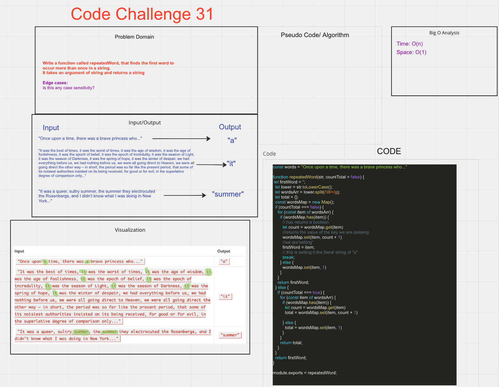

# Code Challenge

## Hashmap Repeated Word

## Challenge/Feature Tasks

- Write a function called repeated word that finds the first word to occur more than once in a string
- Arguments: string
- Return: string

## PR

- PR
  - <<https://github.com/Marthaquinram/data-structure-algorithms-401/pull/11/>>

## Whiteboard

## Starting up

- To run the test, do npm test hashmapRepeated.test.js

## Collaborators

- Collaborator: Tony R. Danny C. Youtuber - codeSTACKr
