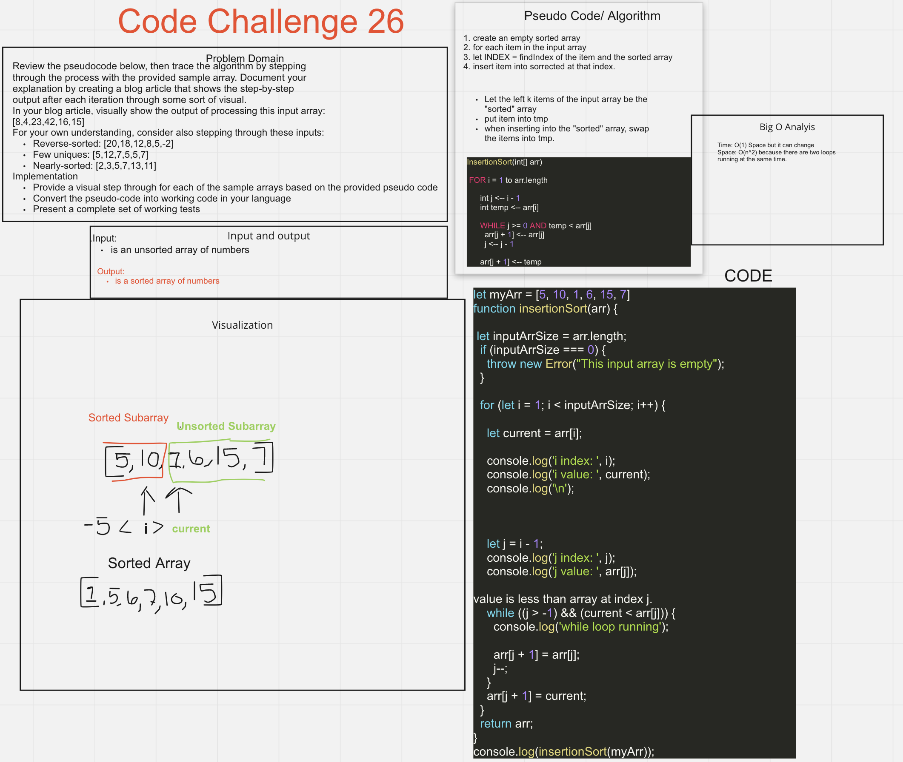

# Insertion Sort

## Challenge 26

Review the pseudocode below, then trace the algorithm by stepping through the process with the provided sample array. Document your explanation by creating a blog article that shows the step-by-step output after each iteration through some sort of visual.
n your blog article, visually show the output of processing this input array:
[8,4,23,42,16,15]
For your own understanding, consider also stepping through these inputs:
Reverse-sorted: [20,18,12,8,5,-2]
Few uniques: [5,12,7,5,5,7]
Nearly-sorted: [2,3,5,7,13,11]
Implementation
Provide a visual step through for each of the sample arrays based on the provided pseudo code
Convert the pseudo-code into working code in your language
Present a complete set of working tests

## Approach & Efficiency

- Went over Code Challenge with David during code review today in class.
  - Insertion Sort
    - sorting: Put things in a specific order
    - Order depends on the data type
    - For instance, numbers have a natural order,
    - Strings can have a natural ordering - lexicographically aka "Alphabetical"
    - EG: Alpha Ant Juliet Romeo
  - Sorting is taking a list ( a one-dimensional collection of items) and putting them in their natural order.
  

## Whiteboard

## Starting up
- To run the test, do npm test insertionSort.test.js

## Collaborators
- Collaborator: Tony R. , Danny C., Sarah T., David did a code review in class and I took notes.

//testing test test
