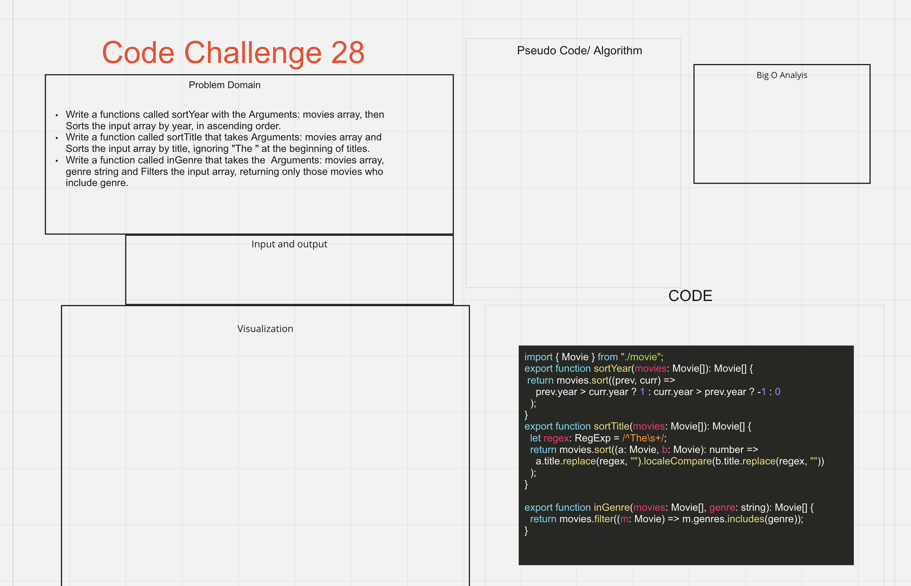

# Sort and Filter Movies

Implement several array sorting comparators and an array filter.

## Specifications

- Read all of these instructions carefully.
- Name things exactly as described.
- Do all your work in a your `data-structures-and-algorithms` public repository.
- Create a new branch in your repo named as noted below.
- Follow the language-specific instructions for the challenge type listed below.
- Update the "Table of Contents" - in the README at the root of the repository - with a link to this challenge's README file.

### Challenge Setup & Execution

**Branch Name:** `sort-and-filter-movies`

**Challenge Type:** Code Challenge / Algorithm

## Feature Tasks

- Implement the functions `sortYear`, `sortTitle`, and `inGenre` in the file `sort.ts`.

  - Execute your tests while developing using `npm run watch`
  - Execute your tests in CI using `npm test`

- Functions:
  - sortYear
    - Arguments: `movies` array
    - Sorts the input array by year, in ascending order.
  - sortTitle
    - Arguments: `movies` array
    - Sorts the input array by title, ignoring `"The "` at the beginning of titles.
  - inGenre
    - Arguments: `movies` array, `genre` string
    - Filters the input array, returning only those movies who include `genre`.

## Requirements

Ensure your complete solution follows the standard requirements.

## Whiteboard

- working on this
  

## Starting up

- To run the test, do npm test sort-and-filter-movies.test.js

## Collaborators

- Collaborator: Tony R. , Danny C., and David
