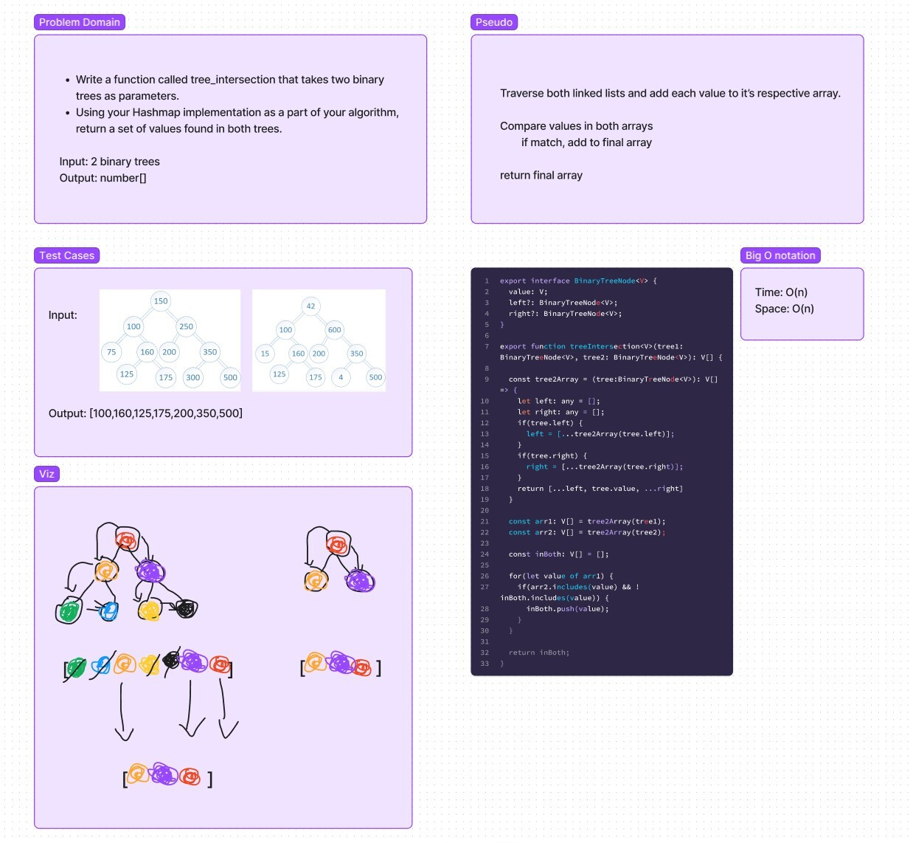

# Tree-Intersection

## Challenge 32

1. Find common values in 2 binary trees.
2. Write a function called tree_intersection that takes two binary trees as parameters.
3. Using your Hashmap implementation as a part of your algorithm, return a set of values found in both trees.

## Whiteboard

- CC32
  

## Collaborators

- Hugo and Luis
